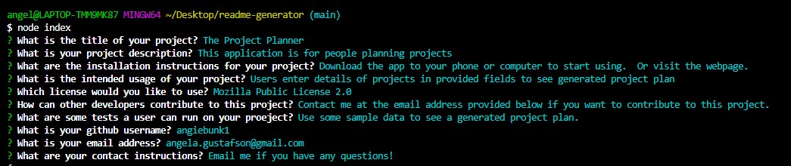
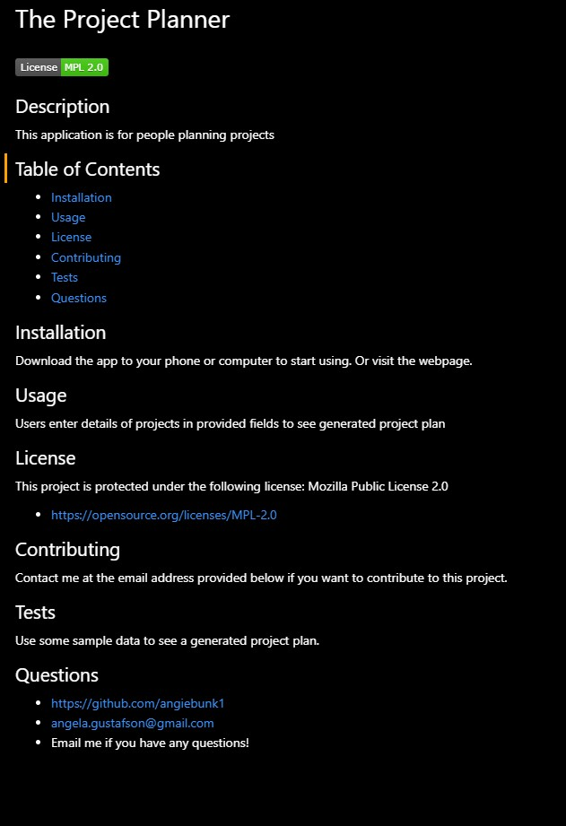

# readme-generator

## Description

This is an application run through node.js that generates a README file. 

## Built With

-  Javascript, using Inquirer

## Demo

-  View a demo video of this application here: https://drive.google.com/file/d/10dkJvdBKxqDAcGCyOJiRcXwQIsOn9HSd/view?usp=sharing

-  Screenshots of node prompts and resulting README:

## Usage

This application can only be run if the user downloads the files, including Inquirer, onto their own computer.  It is then launched through the command terminal by typing "node index".  The user answers the series of prompts and a README file is generated.

## Credits

-  Created by Angela Gustafson (angiebunk1)
-  Starter code provided by Grace Choi (grachoi06) and Xander Rapstine (Xandromus)
